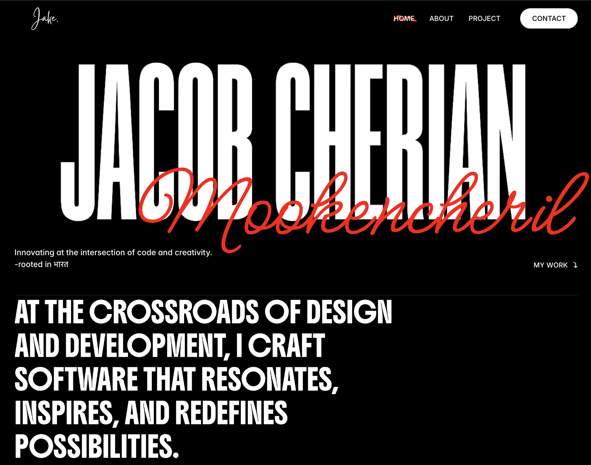
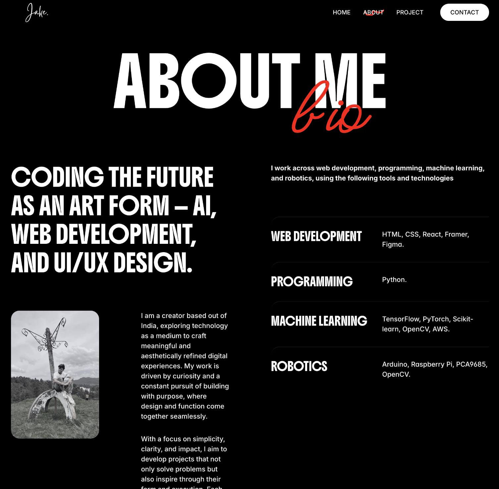
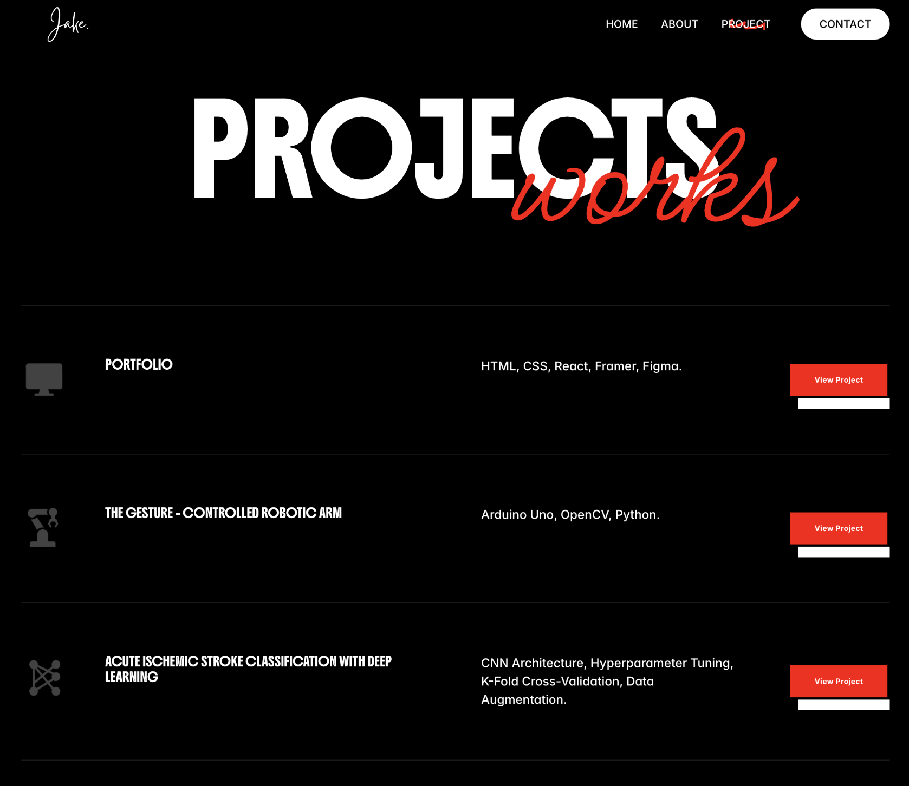

<h3 align="center">Jacob Cherian Mookencheril Portfolio</h3> 

## Overview

Hello! I am **Jacob Cherian Mookencheril (Jake)**, a software developer specializing in **software development, artificial intelligence, and robotics**. This portfolio serves as a professional showcase of my work, skills, and approach to innovation.  

The website embraces a **modern, minimalist dark theme** with red cursive accents, reflecting my philosophy of combining **creativity with technical excellence**.

---

## Features & Highlights

This portfolio has been designed to provide a clear and engaging experience:  

- **Clean, modern design** with intuitive navigation and responsive layouts.  
- **Four main sections**: Home, About, Projects, and Contact.  
- **Project showcase** with detailed descriptions, technologies used, and links for further exploration.  
- **Contact section** with direct access to email, phone number, and social media profiles.  
- **Dynamic visual accents**: Red cursive text follows the cursor, adding a modern, interactive touch.  

---

## Technologies & Tools

The portfolio highlights my expertise across multiple domains:  

1. **Web Development**: HTML, CSS, JavaScript, React, Framer  
2. **UI/UX Design**: Figma, design principles for minimalistic and effective layouts  
3. **App Development**: Flutter, Dart, Provider, Riverpod, RESTful APIs  
4. **Robotics and AI**: Arduino Uno, Raspberry Pi, OpenCV, Python, Deep Learning  

---

## Portfolio Structure

### **Home**
- **Hero Section**: My name and tagline: *“Innovating at the intersection of code and creativity”*.  
- **Mission Statement**: *“At the crossroads of design and development, I craft software that resonates, inspires, and redefines possibilities.”*  
- **Projects Preview**: Highlights of my work across web, AI, app development, and robotics.  
- **Footer**: Quick contact information and social media links.  

### **About Me**
- Personal introduction emphasizing my passion for technology and design.  
- Detailed skills in Web Development, Programming, and Robotics.  
- Professional philosophy: crafting meaningful and aesthetically refined digital experiences.  
- Core values: Problem-solving, collaboration, and multilingual communication (English, Malayalam, Hindi, Tamil).  

### **Projects**
- Detailed showcase of my major projects with key technologies and links to explore further.  
- Featured work includes:
  - Gesture-Controlled Robotic Arm  
  - Acute Ischemic Stroke Classification (Deep Learning)  
  - E-Mart Mobile Application  
  - Legged Robot for Intelligent Navigation  
  - AI Customer Review Analyzer  
  - POKÉDEX  
  - Image Text Extraction  
  - SLAM with RGB-D Kinect Sensor  

### **Contact**
- Invitation to connect and collaborate professionally.  
- Contact details including email, phone, and location in Chennai, India.  

---

## Visual Showcase

    

        <video autoplay loop muted playsinline>
            <source src="final cut 2.mp4" type="video/mp4">
            Your browser does not support the video tag.
        </video>
    

    

        
    

    

        
    

    

        
    

---

## Impact

Through this portfolio, I aim to:  
- Present a **comprehensive view of my skills and projects**.  
- Demonstrate how I combine **technical expertise with creative problem-solving**.  
- Provide a **platform for collaboration, networking, and professional opportunities**.
  
---

## Connect With Me

I am open to collaboration and professional opportunities. You can reach me via:  

- **Email**: jacobcherianmookencheril@gmail.com  
- **Phone**: +91 8330859746  
- **Location**: Chennai, India  

Portfolio Link: [https://jacobcherianmookencheril.framer.website/](https://jacobcherianmookencheril.framer.website/)
